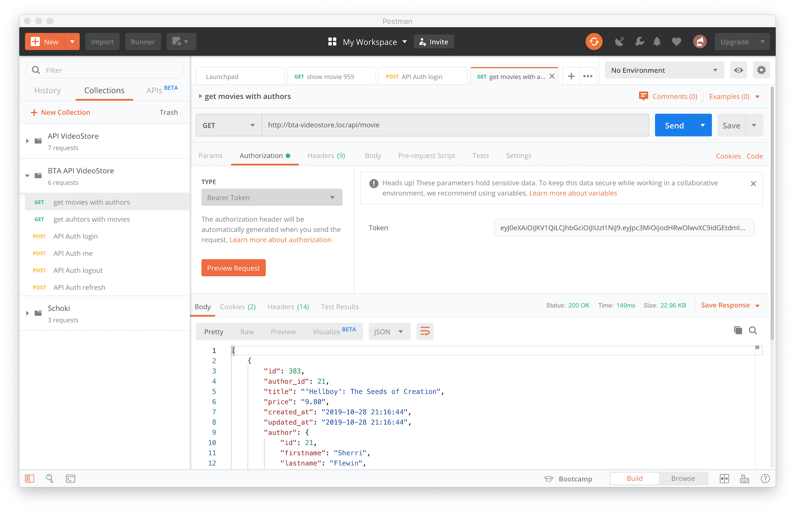

## BTA Laravel videostore-scart Projekt

nach dem clonen von Github folgendes per Terminal im Projektverzeichnis ausführen:

- erstelle eine MySQL Datenbank namens 'videostore' und importiere darin die SQL-Datei aus database/dump.
- (linux, macosx) setup
- (windows) setup.bat

#### oder folgendes einzeln nacheinander:
- composer install
- npm install
- (für lokalen Gebrauch) .htaccess anlegen mit RedirectPermanent Anweisung:
 Verzeichnis im Webroot => VHost Adresse
 (zB: **RedirectPermanent /videostore-scart http://videostore-scart.loc**) 
- npm run dev
- .env.local kopieren nach .env und die darin enthaltenen Conf-Daten anpassen

#### Für Windows DNS in host Datei eintragen (C:\Window\System32\drivers\etc\host)
- 127.0.0.1 videostore-scart.loc
- 127.0.0.1 admin.videostore-scart.loc
- 127.0.0.1 monitor.videostore-scart.loc

#### Apache -> httpd-vhosts.conf
```
# falls noch nicht vorhanden
<VirtualHost *:80>
    ServerName localhost
    DocumentRoot "htdocs"
</VirtualHost>

<VirtualHost *:80>
  ServerName videostore-scart.loc
  DocumentRoot "htdocs/videostore-scart/public"
  ErrorLog "logs/videostore-scart-error_log"
  CustomLog "logs/videostore-scart-access_log" common
</VirtualHost>
```

#### Für Token-Authentifizierung von API-Requests nutzen wir Laravel Sanctum https://laravel.com/docs/8.x/sanctum
Dafür installieren wir laravel/sanctum (composer require laravel/sanctum). 
Da es bereits in der composer.json eingetragen ist, erfolgt die installation bereits über ```composer install```

#### Zum Testen der API-Requests kannst Du Googles Postman nutzen
https://www.getpostman.com/

Wenn installiert, dann kannst Du hier die zu testenden Requests anlegen und ausführen:


#### Fehlermeldungen per Email

Installations Schritte:
https://github.com/berndengels/laravel8-email-exceptions

Für Mailversand in der .env Datei gültige SMTP Werte eintragen. z.B:

```
MAIL_DRIVER=smtp
MAIL_HOST=goldenacker.de
MAIL_PORT=25
MAIL_USERNAME=kurs@goldenacker.de
MAIL_PASSWORD=
MAIL_ENCRYPTION=tls
MAIL_FROM_ADDRESS=Your@Mail-Address
MAIL_FROM_NAME=Your@Mail-Address

EXCEPTION_TO_EMAIL_ADDRESS=Your@Mail-Address
EXCEPTION_FROM_EMAIL_ADDRESS=Your@Mail-Address
EXCEPTION_EMAIL_SUBJECT="Videostore-Scart Error"
```
